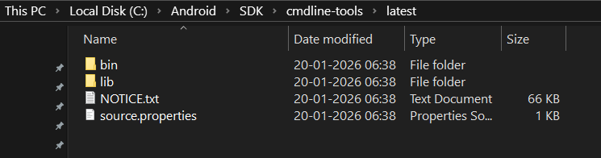
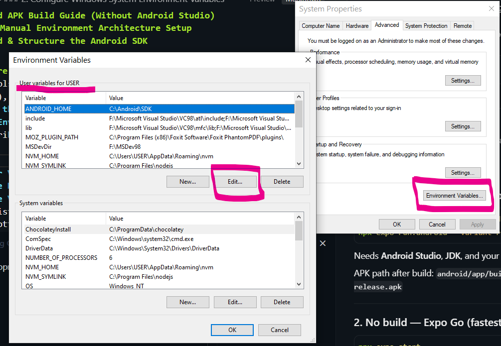
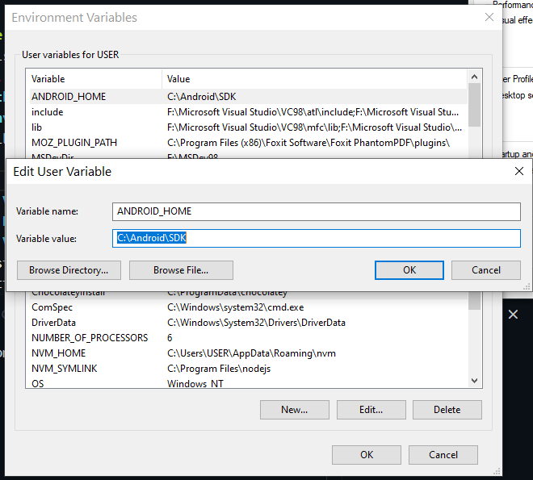
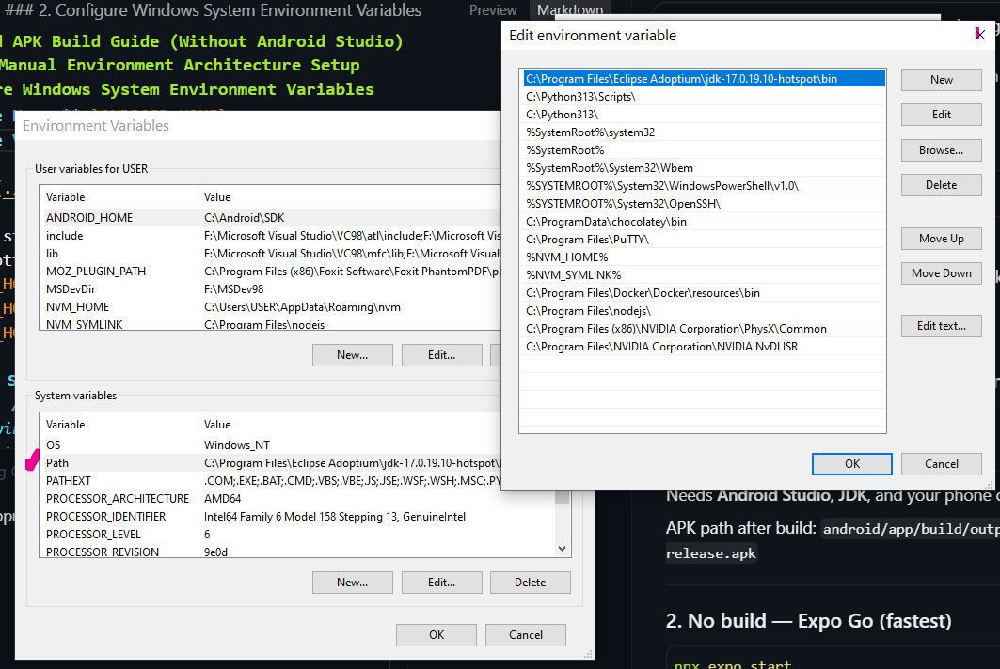

# FutureFund / Expenxer (Expo)

Cross-platform expense and wealth app — Expo/React Native port of the original Kotlin Jetpack Compose Android app (**ExpenseAI** workspace).

## Features

- **Authentication** — Firebase email/password (real accounts, persisted sessions)
- **Dashboard** — Savings hero card, AI tips, liability alerts, 7-day trend chart, category breakdown, savings goals, automation panel
- **Expenses** — Search, category filters, budget trackers, AI auto-categorization (Gemini), receipt scan simulation
- **Planner** — Annual liabilities, subscriptions, budget templates with apply-to-month
- **Split** — Group expense splitting with equal-split settlement engine
- **AI Advisor** — Gemini-powered financial coach chat with full context injection
- **Profile** — Gallery photo upload (Firebase Storage), income/savings rate, alerts, cloud sync (Firestore)
- **Export** — CSV share, PDF print, Google Sheets sync (sandbox + real API), Gmail reports

## Tech Stack

| Android (Kotlin) | Expo (TypeScript) |
|------------------|-------------------|
| Jetpack Compose | React Native + Expo Router |
| Room + Flow | expo-sqlite |
| SharedPreferences | AsyncStorage + Firebase Auth persistence |
| FinancialViewModel | Zustand store |
| Gemini Retrofit | fetch API |
| Coil | expo-image |
| FileProvider + Print | expo-sharing + expo-print |

## Getting Started

```bash
cd futurefund-expo
npm install
cp .env.example .env
# Fill in EXPO_PUBLIC_GEMINI_API_KEY and Firebase keys (see below)
npm expo start

npx expo start

npx expo start -c --web #for clearing cache and starting application in web mode

npx expo start -c  #for clearing cache and starting application
```

Then press `a` for Android, `i` for iOS, or `w` for web.

## Firebase setup (email/password)

1. In [Firebase Console](https://console.firebase.google.com/) → **Authentication** → **Sign-in method**, enable **Email/Password**.
2. Copy `google-services.json` into `futurefund-expo/google-services.json` (optional for native builds; used as reference for env vars).
3. Open `google-services.json` and map values into `.env`:

| `.env` variable | `google-services.json` path |
|-----------------|----------------------------|
| `EXPO_PUBLIC_FIREBASE_API_KEY` | `client[0].api_key[0].current_key` |
| `EXPO_PUBLIC_FIREBASE_AUTH_DOMAIN` | `{project_info.project_id}.firebaseapp.com` |
| `EXPO_PUBLIC_FIREBASE_PROJECT_ID` | `project_info.project_id` |
| `EXPO_PUBLIC_FIREBASE_STORAGE_BUCKET` | `project_info.storage_bucket` |
| `EXPO_PUBLIC_FIREBASE_MESSAGING_SENDER_ID` | `project_info.project_number` |
| `EXPO_PUBLIC_FIREBASE_APP_ID` | `client[0].client_info.mobilesdk_app_id` |

4. Restart Expo after editing `.env` (`npx expo start -c`).

**Note:** `client_secret.json` is for OAuth server flows (e.g. Google Sign-In on web). It is **not** needed for Firebase email/password auth. Do not commit it — it is listed in `.gitignore`.

## Firestore + Storage (user profile sync)

Profile data syncs to **`users/{firebaseAuthUid}`** in Firestore. Profile photos upload to **`users/{uid}/avatar.jpg`** in Storage.

1. Enable **Firestore** and **Storage** in Firebase Console.
2. Publish Firestore rules (see earlier `users/{userId}` rules).
3. In **Storage → Rules**, publish:

**Firestore rules (development trial — convert to production later):**

```javascript
rules_version = '2';

service cloud.firestore {
  match /databases/{database}/documents {
    match /users/{userId} {
      // Own profile: full access
      allow write: if request.auth != null && request.auth.uid == userId;
      // Any signed-in user can read profiles for Split directory search
      // (displayName, email, phoneNumber, searchKeys, photoUrl).
      allow read: if request.auth != null;

      match /{document=**} {
        allow read, write: if request.auth != null && request.auth.uid == userId;
      }
    }

    // Shared split groups — members listed in memberUids
    match /split_groups/{groupId} {
      // get: members, or signed-in users claiming an invite (they know groupId)
      allow get: if request.auth != null;
      allow list: if request.auth != null
        && request.auth.uid in resource.data.memberUids;
      allow create: if request.auth != null
        && request.auth.uid in request.resource.data.memberUids
        && request.resource.data.createdByUid == request.auth.uid;
      // Members can edit; invitees may add themselves if they keep existing memberUids
      allow update: if request.auth != null && (
        request.auth.uid in resource.data.memberUids
        || (
          request.auth.uid in request.resource.data.memberUids
          && request.resource.data.memberUids.hasAll(resource.data.memberUids)
        )
      );
      allow delete: if request.auth != null
        && request.auth.uid in resource.data.memberUids;

      match /expenses/{expenseId} {
        allow read, write: if request.auth != null
          && request.auth.uid in get(/databases/$(database)/documents/split_groups/$(groupId)).data.memberUids;
      }

      match /settlements/{settlementId} {
        allow read, write: if request.auth != null
          && request.auth.uid in get(/databases/$(database)/documents/split_groups/$(groupId)).data.memberUids;
      }
    }

    // WhatsApp / deep-link invites (claim after signup)
    match /split_invites/{inviteCode} {
      allow read: if request.auth != null;
      allow create: if request.auth != null
        && request.resource.data.createdByUid == request.auth.uid;
      allow update: if request.auth != null
        && (resource.data.createdByUid == request.auth.uid
            || resource.data.status == 'pending');
    }

    // Optional open trial (expire soon). Prefer the rules above for Split.
    // match /{document=**} {
    //   allow read, write: if request.time < timestamp.date(2026, 7, 29);
    // }
  }
}
```


**Storage rules:**

```javascript
rules_version = '2';
service firebase.storage {
  match /b/{bucket}/o {
    // Profile photos, receipts, and group avatars (users/{uid}/group_avatars/{groupId}.jpg)
    match /users/{userId}/{allPaths=**} {
      allow read, write: if request.auth != null && request.auth.uid == userId;
    }
  }
}
```

Group images upload to **`users/{uid}/group_avatars/{groupId}.jpg`**. The download URL is saved on the group document so every member can see it. Ensure the `users/{userId}` Storage rule above is published in Firebase Console.

4. Add the same `EXPO_PUBLIC_FIREBASE_*` vars (including `STORAGE_BUCKET`) to **EAS Environment variables** for production APK builds.

On login, the app pulls the cloud profile into local SQLite. On save/upload, it writes to both.

## Environment

- `EXPO_PUBLIC_GEMINI_API_KEY` — AI chat coach and expense auto-categorization
- `EXPO_PUBLIC_FIREBASE_*` — Firebase web config (required for login)

Google Sheets/Gmail sync works in **sandbox mode** without a token (simulated). Provide a real OAuth bearer token in Dashboard → Gmail & Sync Settings for live API calls.

## Project Structure

```
futurefund-expo/
├── app/                    # Expo Router screens
│   ├── login.tsx
│   └── (tabs)/             # 6 bottom tabs
├── src/
│   ├── config/             # Firebase config helpers
│   ├── db/                 # SQLite schema + repository
│   ├── services/           # Firebase, Gemini, Google APIs
│   ├── store/              # Zustand state (ViewModel)
│   ├── theme/              # Color palette
│   └── utils/              # Export, settlements, format
```

## Original Android App

The Kotlin source remains in the parent `ExpenseAI/` directory. This Expo app is a feature-parity rebuild for iOS, Android, and web from a single codebase.

### EXPO Account Login

- **Id:** `pankaj89`
- **Password:** `Pankaj#2026`

### For Building Production Grade application in EXPO Cloud

Run the command to build in Expo Website:

```bash
eas build --platform android --profile production
```

For that you should be logged into EAS. Type command:

```bash
eas login
```

Then provide login credentials as above provided.

If EAS CLI is not installed, install it by:

```bash
npm install -g eas-cli
```

**Note:** Always keep `package-lock.json` in sync with `package.json`. `npm ci` is used in the build process, so any mismatch will trigger an error. In that case remove `node_modules` and `package-lock.json`. On Windows:

```bash
Remove-Item -Recurse -Force node_modules -ErrorAction SilentlyContinue
Remove-Item package-lock.json -ErrorAction SilentlyContinue
npm install
```

Then commit and push the code to GitHub and run the EAS build again:

```bash
eas build --platform android --profile production
```

### Local Android APK Build Guide (Without Android Studio)

This guide documents the exact process used to successfully build an Android APK locally on Windows 10 for an **Expo SDK 56** project **without** installing the heavy Android Studio IDE.

---

## 🛠️ Step 1: Manual Environment Architecture Setup

### 1. Download & Structure the Android SDK
Instead of installing Android Studio, we download the lightweight **command-line** tools.
1. Go to the Android Studio Downloads page and download the **"Command line tools only"** Windows `.zip`.
2. Create a permanent system directory at: `C:\Android\SDK`
3. Inside it, create the required nested subfolders: `C:\Android\SDK\cmdline-tools\latest`
4. Extract the downloaded `.zip` file contents (`bin`, `lib`, `source.properties`, `NOTICE.txt`) directly into that `latest` folder.




### 2. Configure Windows System Environment Variables
To make the tools accessible globally across terminals (like Cursor or standard `cmd`), update the environment paths:
1. Open **Edit the system environment variables** in Windows. In Windows button type **Environment Variables** and then open by clicking on the Environment Varibles at the bottom-right corner.



2. Under **User Variables**, add a new variable:
   * **Variable Name:** `ANDROID_HOME`
   * **Variable Value:** `C:\Android\SDK`



3. Edit the existing **`Path`** variable and append these three separate lines to the bottom:
   * `%ANDROID_HOME%\cmdline-tools\latest\bin`
   * `%ANDROID_HOME%\platform-tools`
   * `%ANDROID_HOME%\build-tools\36.0.0`



---

## ⚠️ Stumbling Blocks & Resolution Logs (Troubleshooting)

During this setup, we ran into two critical alignment roadblocks that were manually debugged and resolved:

### Block 1: Java Version Mismatch (`java -version` crashed the build)
* **The Issue:** The computer originally ran **Java 25 (OpenJDK Temurin-25)**. While modern, **Java 25** is completely incompatible with the Android Gradle Plugin bundled in Expo SDK 56. Running a build on Java 25 triggers an immediate `Unsupported class file major version` terminal failure.
* **The Fix:** We downgraded the local runtime environment strictly to **Java 17 (OpenJDK Temurin-17)**.
* **Verification:** Open a fresh `cmd` and execute:
  ```cmd
  java -version
  ```
  It must output `openjdk version "17.0.x"`.

### Block 2: Expo SDK 56 Target Alignment
* **The Issue:** Default guides often request downloading Android Build Tools 34. However, **Expo SDK 56 requires Android API Level 36**.
* **The Fix:** We targeted the specific version packages inside the command line downloader tool and updated our environmental variables to watch version `36.0.0`.

---

## 🚀 Step 2: Fetch Dependencies via CLI

With your environment variables mapped, open a new Windows Command Prompt (`cmd`) and run this command to install the required API Level 36 dependencies:

```cmd
sdkmanager --install "platforms;android-36" "build-tools;36.0.0" "platform-tools"
```
*(Type `y` and hit Enter when prompted to accept the developer license agreements).*

---

## 💻 Step 3: Install OpenJDK 17
1. Download the Windows x64 Installer for OpenJDK 17 (LTS) from: https://adoptium.net/

2. Run installer and install default.

3. Check installation from ``cmd`` using 
```cmd
java -version
```


## 💻 Step 4: Run the Local Expo Compile Process

1. Open your project folder directly inside **Cursor** with **Command Prompt (cmd)** in the terminal.
2. Run the following deployment script:

```cmd
:: 1. Wipe old configurations and generate the native /android framework files
npx expo prebuild --clean

:: 2. Shift directory into the newly generated native layer
cd android

:: 3. Run the local Gradle assembler wrapper to build the standalone binary
gradlew assembleRelease
```

---

## 📦 Where to Find Your Completed APK

Once the terminal screen prints a green `BUILD SUCCESSFUL` announcement, your standalone application installer can be located directly in your Cursor file directory tree under:

`futurefund-expo/android/app/build/outputs/apk/release/app-release.apk`

Right-click the `app-release.apk` file inside Cursor and select **Reveal in File Explorer** to transfer it to a physical device for runtime testing!


## Future Agentic AI Planning

Current foundation: Gemini Advisor chat (full financial context, images, voice), AI expense categorization, and dashboard charts (spend / category / split). Forecasts today are mostly arithmetic (saving goals, EMI math), not trained ML. The roadmap below focuses on agents that *act*, proactive insights, Advisor analytics, and real-world money features.

### AI agents (do work, not just chat)

- **Expense logger agent** — “Spent ₹450 on Swiggy” → creates the expense with category and date
- **Budget agent** — proposes monthly category budgets from history and applies them with confirmation
- **Bill / EMI reminder agent** — watches due dates, nudges before overdue, suggests “pay from surplus”
- **Split settlement agent** — “Settle with Rahul” → computes net, creates settlement, notifies
- **Receipt agent** — photo → merchant, amount, date, category → draft expense (`Gemini Vision` structured fields in one step when adding an expense from an uploaded bill)
- **Goal coach agent** — adjusts saving-goal contributions when income or spend changes
- **Anomaly agent** — flags unusual spikes vs normal patterns and explains why (category + time-of-year seasonality)

### AI features (insights / UX)

- Proactive weekly digest: “You overspent Food by 28%; cut dining 2× to stay on track”
- Natural-language search: “Show UPI spends over ₹2k last month”
- Smart duplicate detection (same merchant / amount / day)
- Subscription waste finder (“unused” or rising recurring charges)
- Peer / split fairness tips (“you’re owed ₹X across 3 groups”)
- Voice-first logging without opening Advisor
- Multi-turn tool calling so Advisor can *create* budgets/expenses, not only advise
- Comparison line chart: usual spending (line A) vs current month (line B)

### Advisor charts / analytics

Advisor replies are text/markdown today; charts live on Home/Split. Advisor *can* show analytics charts:

1. **Chart cards in chat** — model returns structured data (e.g. `{ type: "category_pie", month: "…" }`) and the UI renders existing SVG chart components
2. **“Analyze” mode** — user asks “compare this month vs last” → numbers + an embedded chart
3. **Deep-link** — Advisor answers and opens the matching dashboard chart

### Future predictions (ML and beyond)

Yes — predictions can use ML. Prefer a layered approach:

| Approach | What it predicts | Effort |
|----------|------------------|--------|
| Rules + stats (median, moving avg) | Next-month spend, category burn rate | Low |
| Time-series (Prophet / simple regression) | Monthly totals, cash runway | Medium |
| LLM + history (current stack) | Narrative forecast (“at this pace…”) | Already close |
| Classical ML (e.g. XGBoost) | Category next month, overspend risk | Medium–high |
| Deep models | Only with large clean user datasets | High |

For personal finance, **stats + LLM explanation** usually beats heavy ML until histories are long and clean. Highest-value ML targets: overspend probability, “will I hit this goal?”, festival/rent seasonality, and subscription churn risk.

### Real-world integrations worth building

**Money hygiene**

- Receipt / invoice OCR into expenses
- Bank / UPI SMS or statement import (CSV → categorized ledger)
- Recurring detection + cancel/remind for subscriptions
- Cash-flow calendar (salary in, EMIs/bills out, free cash left)
- “Safe to spend today” number
- Tax-ready export (category packs, FY reports for India)

**Accountability & social**

- Shared household budget (beyond Split)
- Gentle partner/family visibility with privacy controls
- Debt payoff planner (snowball / avalanche)

**Trust & safety**

- Confirmation before any agent writes data
- Audit log of AI actions
- On-device / local-first options for sensitive receipts where possible

**Engagement (practical, not gimmicky)**

- Weekly AI brief (push) instead of endless chat
- Goal milestones with concrete next actions
- Merchant-level insights (“Zomato is 18% of discretionary”)

### Highest-ROI next steps

1. Receipt OCR (`Gemini Vision` → structured expense fields)
2. Action agents (log expense / set budget / settle split) with user confirmation
3. Proactive anomaly / spend-spike digests (push + Advisor)
4. Advisor-embedded charts and usual-vs-current spend comparison